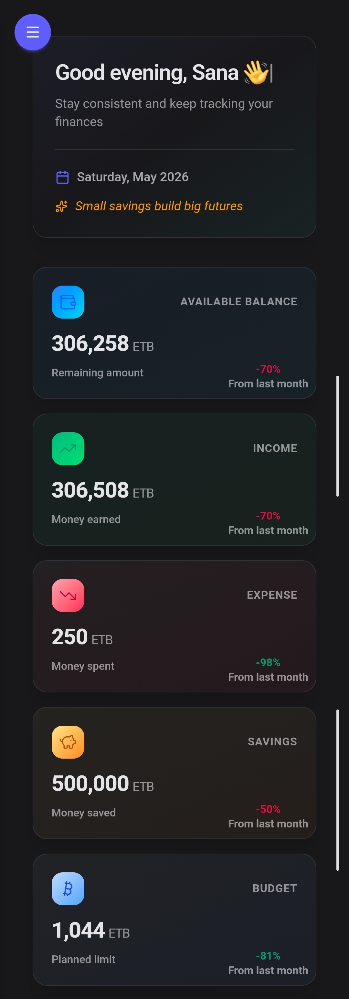

<!-- Banner -->


# 💰 CashVolt — Personal Finance Management Platform

<p align="center">
  
  
  
</p>

> A modern full-stack personal finance management platform built with the **PERN Stack**.

CashVolt helps users manage income, expenses, budgets, and financial insights through a fast, scalable, and intuitive dashboard experience.

Designed with modern frontend architecture and secure backend systems, the platform focuses on performance, usability, and production-grade scalability.


## 🌐 Live Demo

<p align="center">
  <a href="https://cash-volt.vercel.app">
    
  </a>
</p>

<p align="center">
  <a href="https://cash-volt.vercel.app">
    
  </a>
</p>

## ✨ Highlights

- Secure JWT Authentication
- Budget & expense management
- Real-time financial analytics
- Interactive dashboard system
- Optimized API caching
- Responsive modern UI
- Scalable PERN architecture

# 🛠️ Tech Stack

## 🎨 Frontend

<p>
  
</p>

- React 19
- TypeScript
- Vite
- Tailwind CSS v4
- DaisyUI
- Zustand
- TanStack Query
- React Hook Form
- Zod Validation
- Axios
- Framer Motion
- Chart.js

## ⚙️ Backend

<p>
  
</p>

- Node.js
- Express.js
- Neon PostgreSQL
- Redis
- JWT Authentication
- Zod Validation
- Winston Logger

# 🚀 Core Features

## 🔐 Authentication System
- JWT authentication
- Refresh token rotation
- Protected routes
- HTTP-only cookies
- Role-based access control

## 💳 Finance Management
- Income & expense tracking
- Multi-account management
- Budget planning system
- Category organization
- Transaction history

## 📊 Analytics Dashboard
- Financial summaries
- Expense breakdown charts
- Income vs expense visualization
- Monthly and yearly analytics

## ⚡ System Features
- Responsive modern UI
- Dark / light theme support
- Optimized API requests
- Rate limiting & backend security
- Error handling & validation
- Modular scalable architecture

# 🏗️ Architecture

```bash
Client (React + Vite)
        ↓
API Layer (Axios + React Query)
        ↓
Server (Express + TypeScript)
        ↓
Database (Neon PostgreSQL)
```

# 📁 Project Structure

```bash
CashVolt/
│
├── client/
│   └── src/
│       ├── api/
│       ├── components/
│       ├── context/
│       ├── pages/
│       ├── hooks/
│       ├── types/
│       ├── utils/
│       ├── App.tsx
│       ├── index.css
│       └── main.tsx
│    
├── server/
│   └── src/
│       ├── config/
│       ├── middleware/
│       ├── modules/
│       ├── utils/
│       ├── App.js
│       └── server.js
│
└── README.md
```

# ⚡ Installation

## 📥 Clone Repository

```bash
git clone git@github.com:matusalasana/CashVolt.git
```

## 📂 Navigate Into Project

```bash
cd CashVolt
```

# 🎨 Frontend Setup

## 📁 Navigate To Frontend

```bash
cd client
```

## 📦 Install Dependencies

```bash
npm install
```

## 🚀 Start Frontend Development Server

```bash
npm run dev
```

Frontend runs on:

```bash
http://localhost:5173
```

# 🛠️ Backend Setup

## 📁 Navigate To Backend

```bash
cd server
```

## 📦 Install Dependencies

```bash
npm install
```

## 🔑 Create Environment Variables

Create a `.env` file:

```env
PORT=3000

DATABASE_URL=your_neon_database_url

JWT_SECRET=your_jwt_secret

FRONTEND_URL=your_frontend_url

FRONTEND_LOCALHOST_URL=http://localhost:5173

NODE_ENV=development
```

## 🚀 Start Backend Development Server

```bash
npm run dev
```

Backend runs on:

```bash
http://localhost:3000
```

# 🌍 Deployment

CashVolt can be deployed on:

## 🎨 Frontend
- Vercel
- Netlify

## 🛠️ Backend
- Railway
- Render
- VPS
- Docker
- AWS

# 🚀 Performance Optimizations

- React Query Caching
- Optimized API Calls
- Bundle Optimization
- Code Splitting

# 🔮 Future Improvements

- Email Notifications
- AI Insights 
- Real-Time Notifications
- Mobile Application
- Exportable financial reports

# 👨‍💻 Author

### Sana — Full-Stack Developer

<p align="left">
  <a href="mailto:matusalasana@gmail.com">
    
  </a>

  <a href="#">
    
  </a>

  <a href="#">
    
  </a>
</p>

### ⭐ Thanks for visiting

